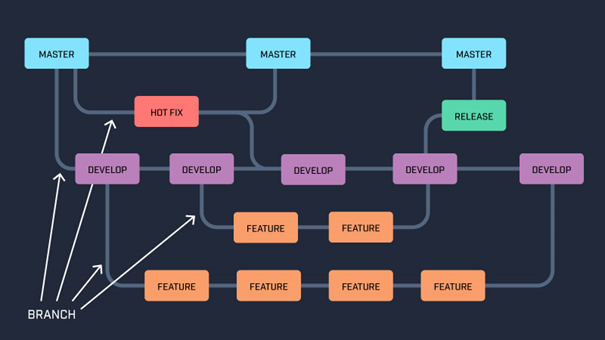

# Konfigurationsmanagement

## Source Code / Versionsverwaltung

- Verwendete Versionsverwaltung: Git

- Source Code wird auf [GitHub](https://github.com/Bennik2000/SWE-19in) abgelegt

- Merge Strategie ist GitFlow:

  

## Versionierung

- Jede Version bekommt ein Tag
- Semantische Versionierung: [Major].[Minor].[Patch]

## Code Style

- TypeScript:
  - Verwendeter Code Style für TypeScript: https://github.com/basarat/typescript-book/blob/master/docs/styleguide/styleguide.md 
  - Falls etwas dort nicht beschrieben ist, wird der CodeStyle von Google verwendet: https://google.github.io/styleguide/tsguide.html

- Python:
  - Verwendeter CodeStyle für Python: PEP 8: https://www.python.org/dev/peps/pep-0008/ 